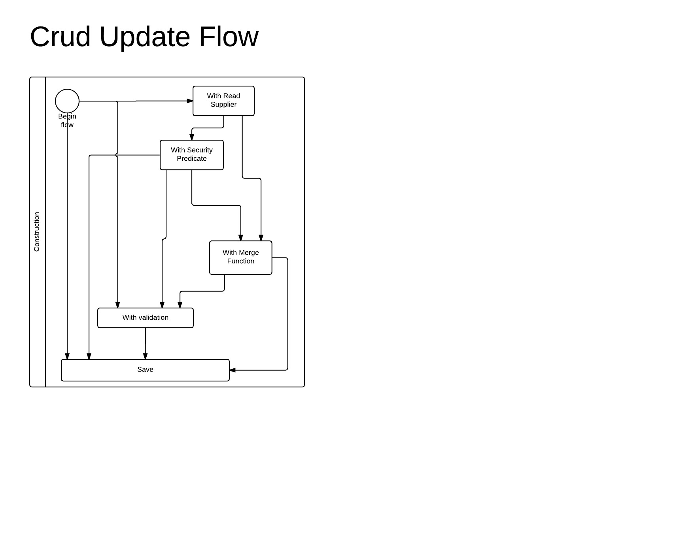

# crud-operations-dsl
Based to java 8. Help to create crud operation with some validations.

## Sample

### Read

* Without validation - will throws a `ResourceNotFoundException` if the result of the `Supplier` is an empty `Optional`.
  
  * Start by Sync Supplier

          CrudOperations
              .readOf(() -> Optional<ResultType>)
              .read();
  * Start by Async Supplier
  
  
          CrudOperations
              .readAsyncOf(() -> CompletableFuture<Optional<ResultType>>))
              .readAsync();

* With security validation - will call the `Predicate` with the result of the `Supplier` (if not empty). If the validation is wrong will throws an `UnauthorisedAccessException`

  * Start by Sync Supplier

          CrudOperations
                .readOf(() -> Optional<ResultType>)
                .withSecurityCheck(Predicate<ResultType>)
                .read();

          ----

          CrudOperations
                .readOf(() -> Optional<ResultType>)
                .withSecurityCheck(Function<ResultType, CompletableFuture<Boolean>>)
                .readAsync();

  * Start by Async Supplier

          CrudOperations
                .readAsyncOf(() -> CompletableFuture<Optional<ResultType>>)
                .withSecurityCheck(Predicate<ResultType>)
                .readAsync();

          ----

          CrudOperations
                .readAsyncOf(() -> CompletableFuture<Optional<ResultType>>)
                .withSecurityCheck(Function<ResultType, CompletableFuture<Boolean>>)
                .readAsync();

### Creation

      CrudOperations
            .createOf(request, Function<RequestType, RequestType>)
            .create(); // returns <RequestType>

      -------

      CrudOperations
            .createOf(request, Function<RequestType, RequestType>)
            .withValidation(Predicate<RequestType>)
            .create(); // returns <RequestType>

      -------

      CrudOperations
            .createOf(request, Function<RequestType, RequestType>)
            .withValidation(Function<RequestType, CompletableFuture<Boolean>)
            .createAsync(); // returns CompletableFuture<RequestType>

      -------

      CrudOperations
            .createAsyncOf(request, Function<RequestType, CompletableFuture<RequestType>>)
            .createAsync(); // returns CompletableFuture<RequestType>

      -------

      CrudOperations
            .createAsyncOf(request, Function<RequestType, CompletableFuture<RequestType>>)
            .withValidation(Predicate<RequestType>)
            .createAsync(); // returns CompletableFuture<RequestType>

      -------

      CrudOperations
            .createAsyncOf(request, Function<RequestType, CompletableFuture<RequestType>>)
            .withValidation(Function<RequestType, CompletableFuture<Boolean>)
            .createAsync(); // returns CompletableFuture<RequestType>

### Update

* The creation process will follow the next `flow`

### Delete

`Not yet implemented`